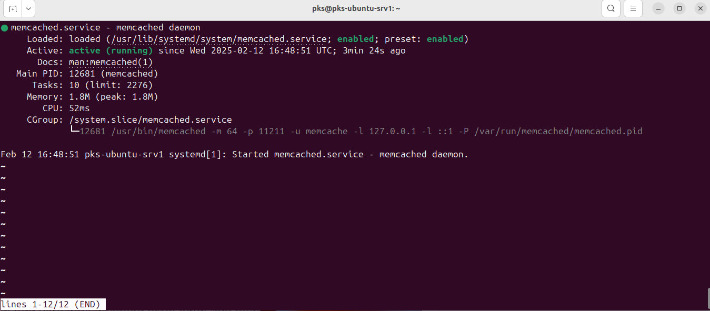
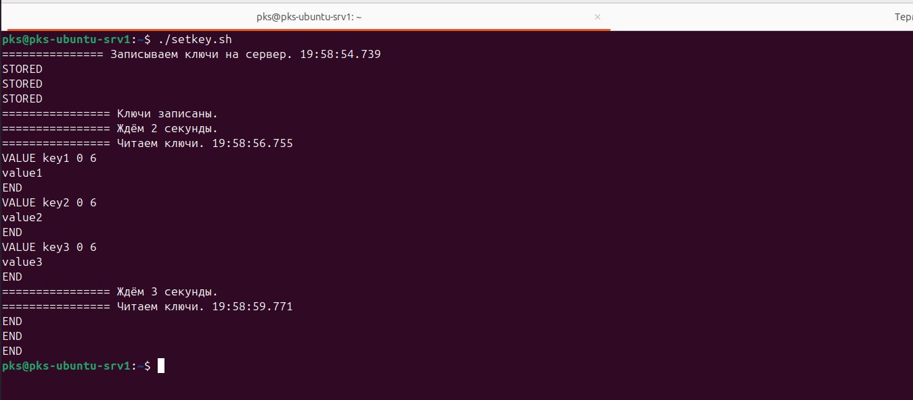
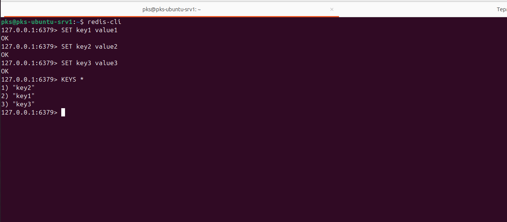
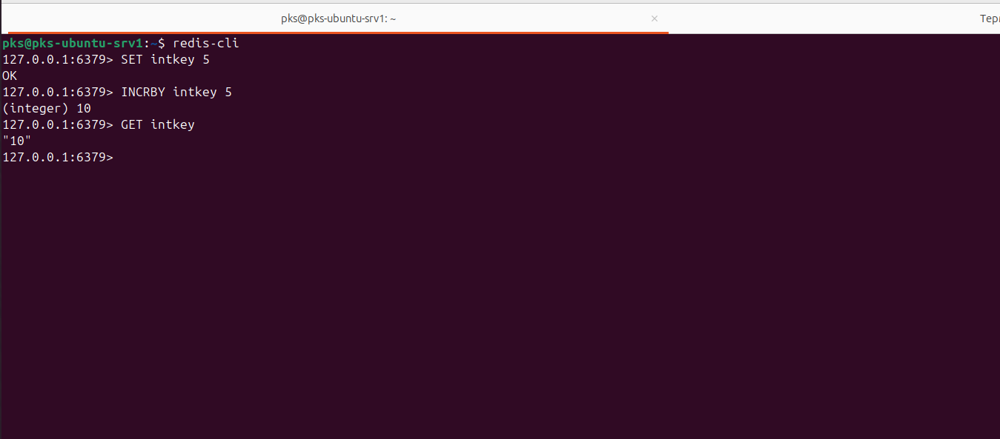

# Домашнее задание к занятию «Кеширование Redis/memcached» - Политико Ксения

### Задание 1. Кеширование
Приведите примеры проблем, которые может решить кеширование.

Приведите ответ в свободной форме.

Кеширование — это эффективный метод оптимизации производительности систем, который позволяет ускорить доступ к данным и снизить нагрузку на ресурсы. Вот несколько примеров проблем, которые можно решить с помощью кеширования:

#### 1. Ускорение доступа к данным
Проблема: Медленное выполнение запросов к базам данных или внешним API.

Решение: Кеширование результатов запросов позволяет быстрее возвращать данные, если они уже были запрошены ранее.

#### 2. Снижение нагрузки на серверы
Проблема: Высокая нагрузка на серверы из-за частых запросов к одним и тем же данным.

Решение: Кеширование снижает количество запросов к серверу, так как данные возвращаются из кеша.

#### 3. Оптимизация работы с медленными источниками данных
Проблема: Задержки при работе с медленными дисками, базами данных или внешними сервисами.

Решение: Кеширование позволяет хранить часто используемые данные в быстрой памяти (например, оперативной), что ускоряет доступ.

#### 4. Уменьшение затрат на вычисления
Проблема: Ресурсоемкие вычисления или обработка данных, которые повторяются при каждом запросе.

Решение: Кеширование результатов вычислений позволяет избежать повторного выполнения операций.

#### 5. Повышение отказоустойчивости
Проблема: Зависимость от внешних сервисов или баз данных, которые могут быть недоступны.

Решение: Кеширование позволяет временно обслуживать запросы из кеша, даже если основной источник данных недоступен.

#### 6. Оптимизация работы с API
Проблема: Ограничение на количество запросов к внешним API (rate limiting).

Решение: Кеширование ответов API позволяет уменьшить количество запросов и избежать превышения лимитов.

#### 7. Ускорение загрузки веб-страниц
Проблема: Медленная загрузка страниц из-за большого количества запросов к серверу.

Решение: Кеширование статических ресурсов (CSS, JS, изображения) или даже целых страниц на стороне клиента или сервера.

#### 8. Снижение нагрузки на сеть
Проблема: Высокая сетевая нагрузка из-за передачи одних и тех же данных.

Решение: Кеширование на уровне CDN (Content Delivery Network) или прокси-серверов уменьшает объем передаваемых данных.

#### 9. Оптимизация работы с большими объемами данных
Проблема: Медленный доступ к большим объемам данных, которые редко изменяются.

Решение: Кеширование таких данных позволяет ускорить доступ и снизить нагрузку на хранилище.

#### 10. Улучшение пользовательского опыта
Проблема: Задержки при взаимодействии пользователя с приложением.

Решение: Кеширование данных на клиентской стороне (например, в браузере) позволяет ускорить работу приложения.

#### Примеры использования кеширования:
Веб-приложения: Кеширование HTML-страниц, изображений, CSS и JavaScript.

Базы данных: Кеширование результатов запросов (например, с использованием Redis или Memcached).

Мобильные приложения: Кеширование данных на устройстве для работы в оффлайн-режиме.

CDN: Кеширование контента на edge-серверах для ускорения доступа пользователей.

Кеширование — это мощный инструмент, который помогает решать множество задач, связанных с производительностью, масштабируемостью и надежностью систем.

### Задание 2. Memcached
Установите и запустите memcached.

Приведите скриншот systemctl status memcached, где будет видно, что memcached запущен.

### Задание 3. Удаление по TTL в Memcached
Запишите в memcached несколько ключей с любыми именами и значениями, для которых выставлен TTL 5.

Приведите скриншот, на котором видно, что спустя 5 секунд ключи удалились из базы.

### Задание 4. Запись данных в Redis
Запишите в Redis несколько ключей с любыми именами и значениями.

Через redis-cli достаньте все записанные ключи и значения из базы, приведите скриншот этой операции.

### Задание 5*. Работа с числами
Запишите в Redis ключ key5 со значением типа "int" равным числу 5. Увеличьте его на 5, чтобы в итоге в значении лежало число 10.

